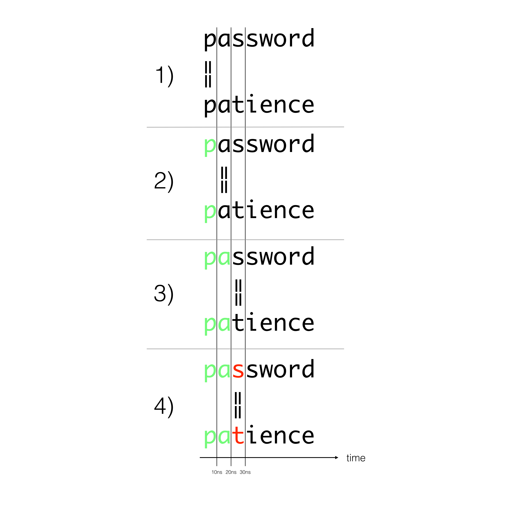

Timing Attacks are a particular type of attacks that use flaws in code that impact the execution time to discover hints about secrets.

# TLDR

Don't use string comparison `==` when checking for secrets or token equality. Use safe implementations.

# Vulnerable code

For example this Python code is vulnerable from timing attacks:

```python
def is_authorized(token):
    if token == 'MY_SECURE_TOKEN':
        return True
    else:
        return False
```

# Vulnerability explanation

While being very simple, it's vulnerable. Why? The code that compares two string is equivalent to this one:

```python
def str_equals(first_string, second_string):
    if len(first_string) != len(second_string):
        return False

    for c1, c2 in zip(first_string, second_string):
        if c1 != c2:
            return False

    return True
```

It iterates on each character of the two string and return `False` as soon as two characters differs. It means that comparing two strings doesn't take the same amount of time if it's the first or last character that is different.



The difference can feels negligible and it's indeed very small but statistics dictates that every small difference can be detected with enough measures. Moreover network jitter is more and more precisely modeled and can be removed from measures over internet. According to [one of the reference paper on the subject](http://www.cs.rice.edu/~dwallach/pub/crosby-timing2009.pdf), "We have shown that, even though the Internet induces significant timing jitter, we can reliably distinguish remote timing differences as low as 20µs".

Timing attacks can occur if the attacker control the value that is compared to the secret. For a authorization key for example, if he discover that the first character is `f`, he can start sending keys starting by `f` to find other characters.

It's not the same if the value compared is first hashed, if he discover that the first character of `hashed(password)` if `f`, finding hashes starting by `f` would be very hard for him, making this attack less realizable with hashes.

# Not vulnerable code

The solution to avoid this problem is to compare the two strings in a way that is not dependent to the size of the strings. This algorithm is called constant time string comparison.

To do this successfully the algorithm must:

 - Compare all of the characters before returning true or false.
    - returning early will leak information
 - Compare strings of equal length
    - if one string is longer or shorter, you'll return early and leak information about string length

Django provides a function [`constant_time_compare`](constant_time_compare) that can be used to securely check two strings.

The python standard lib also provides the function [`hmac.compare_digest`](https://docs.python.org/3/library/hmac.html#hmac.compare_digest) only in Python 3.3+.

# Example of attack




<a href="{{ site.github_url | append:'/tree/master/' | append:dirname | append:'/_' | append:page.language }}">You can play with the code located there.</a>

## References:

- [https://codahale.com/a-lesson-in-timing-attacks/](https://codahale.com/a-lesson-in-timing-attacks/)
- [http://www.cs.rice.edu/~dwallach/pub/crosby-timing2009.pdf](http://www.cs.rice.edu/~dwallach/pub/crosby-timing2009.pdf)
